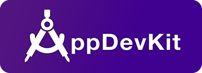
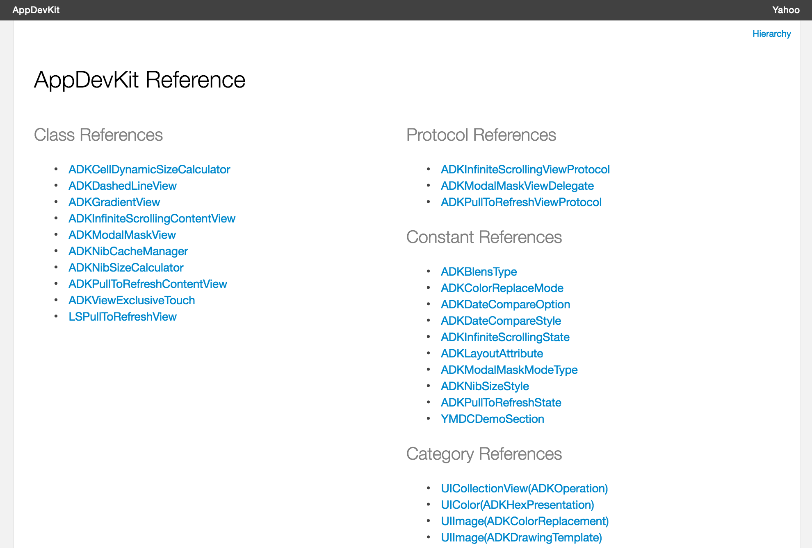

# AppDevKit
 

AppDevKit is an iOS development library that provides developers with useful features to fulfill their everyday iOS app development needs.

Yahoo’s Taiwan based iOS app development team has been using this development kit for the past three years, and we plan future apps to use AppDevKit as well. Our use of this code in many apps helped improve its stability and utility. We find these libraries help address some incompatibility issues found in different iOS versions, and overall make app development easier and our apps operate more consistently. 

AppDevKit has five major parts that include command, user interfaces, animations, image view, and list view support libraries. AppDevKit could be installed by CocoaPods. Please feel welcome to use AppDevKit in your iOS projects as it is licensed under the permissive open source BSD license. 

You can help contribute improvements to this project too. If you have suggestions, corrections, or enhancements, please send us a pull request. If you have questions for the team, you can contact **cfsung@yahoo-inc.com** directly, or the core team at **app-dev-kit@yahoo-inc.com**. Thank you for checking this out. 

## Usage

### Installation with CocoaPods

The easiest way to leverage AppDevKit is using CocoaPods. Please edit your **Podfile** like this:

<pre>
source 'https://github.com/CocoaPods/Specs.git'  

pod 'AppDevKit'
</pre>

AppDevKit has 5 sub-pods. They're **AppDevCommonKit**, **AppDevUIKit**, **AppDevAnimateKit**, **AppDevImageKit** and **AppDevListViewKit**. If you don't want to install whole package, you could pick sub-library and use CocoaPods to install it. For example:

<pre>
source 'https://github.com/CocoaPods/Specs.git'  

# Only insatll image kit in AppDevKit
pod 'AppDevKit/AppDevImageKit'
</pre>

### Basic Usage
  
  Using this develop kit is very simple. First at all, import it in your any code file or just put it in prefix file (.pch). Then you will enjoy this develop kit. 
  
    #import <AppDevKit.h>

### Common Tools

  - **ADKAppUtil** > The foundational tools to support common tasks.
  - **ADKStringHelper** > The string formatter that will generate formatted stings form date, number and etc for you.
  - **ADKCalculatorHelper** > The calculation set including distance, size, width, height, etc.
  - **ADKNibCacheManager** > The manager to cache different instances in memory and keep it as a singleton.
  - **UIView+ADKGetUIViewController** > Supports get any view's UIViewController.
  - **UIColor+ADKHexPresentation** > Supports HEX color format and color shift.
  - **ADKViewExclusiveTouch** > Supports exclusive touch on each sub views.

### UI Tools

  - **UIView+ADKAutoLayoutSupport** > Supports command autolayout features.
  - **UIScrollView+ADKPullToRefreshView** > Supports pull to refresh feature on scrollable view. For example: UIScrollView, UITableView and UICollectionView.
  - **UIScrollView+ADKInfiniteScrollingView** > Supports infinite scrolling feature on scrollable view. For example: UIScrollView, UITableView and UICollectionView.
  - **ADKModalMaskView** > Providing a way to create a modal view for presenting specific view.
  - **ADKGradientView** > Creates a gradient view for you.
  - **ADKDashedLineView** > Creates a dashed line around your view.

### Animation Tools
  - **UIView+ADKAnimationMacro** > Gives some simple animation behavior for specific UIView.
  

### Image Tools

  - **UIImage+ADKColorReplacement** > Supports color changing / replacement feature on UIImage.
  - **UIImage+ADKImageFilter** > Supports image FX, resize, crop, etc. on UIImage.
  - **UIImage+ADKDrawingTemplate** > Supports loss less image from a PDF source.

### ListView Tools
  
  - **UICollectionView+ADKOperation** > Supports force stop scrolling in collection view.
  - **ADKNibSizeCalculator** > Provides correct cell size for different devices effectively.
  - **ADKCellDynamicSizeCalculator** > Calculates dynamic cell with and height for UICollectionViewCell and UITableViewCell.
  - **ADKCollectionViewDynamicSizeCell** > Base UICollectionViewCell supports dynamic width and height features.
  - **ADKTableViewDynamicSizeCell** > Base UITableViewCell supports dynamic width and height features.

### Instruction

  - **Introduction of AppDevKit** > http://www.slideshare.net/anistarsung/appdevkit-for-ios-development
  - **Tutorial materials** > https://github.com/anistarsung/AppDevKitLearning (It includes templates and tutorials that you can use them for training purpose)
  - **Presenting YDevelopKit (AppDevKit) in YMDC 2016** > https://youtu.be/I9QDYDGcn8M
  - **Sample Codes** has been written in AppDevKit project. You can read code to know about "How to implement these features in your project". Just use git to clone AppDevKit to your local disk. It should run well with your XCode. 
  - **API Reference Documents** > Please refer the [gh-pages](https://yahoo.github.io/AppDevKit/) in AppDevKit project.
  

### License

This software is free to use under the Yahoo! Inc. BSD license.
See the [LICENSE] for license text and copyright information.

[LICENSE]: https://github.com/yahoo/AppDevKit/blob/master/LICENSE.md
