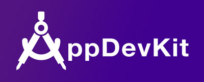

# AppDevKit  

AppDevKit is an iOS development library that provides foundational and developer everyday required features for their iOS app development. It has been used by Yahoo’s iOS app production for 3 years, and future outsourcing apps will also be using AppDevKit. The stability and scalability has been verified on these production apps. It makes difficult development tasks easier and has saved 30% development time in real case. It also covers incompatibility issues caused by different iOS platforms.

It has 5 major parts that include command, user interfaces, animate, image and list view support libraries. Please leverage AppDevKit in your iOS project or join our development group of AppDevKit. We will maintain this project for you.

If you have any idea to improve this project, please feel free to contact with me (**cfsung@yahoo-inc.com**) and core team (**y-develop-kit@yahoo-inc.com**) or send **Pull Request** to us. Thank you. 

## Usage

### Installation with CocoaPods

The easiest way to leverage AppDevKit is using CocoaPods. Please edit your **Podfile** like this:

<pre>
source 'https://github.com/CocoaPods/Specs.git'  

pod 'AppDevKit'
</pre>

### Basic Usage
  
  Using this develop kit is very simple. First at all, import it in your any code file or just put it in prefix file (.pch). Then you will enjoy this develop kit. 
  
    #import <AppDevKit.h>

### Common Tools

  - **ADKAppUtil** > The foundational tools to support common tasks.
  - **ADKStringHelper** > The string formatter that will generate formatted stings form date, number and etc for you.
  - **ADKCalculatorHelper** > The calculation set including distance, size, width, height, etc.
  - **ADKNibCacheManager** > The manager to cache different instances in memory and keep it as a singleton.
  - **UIView+ADKGetUIViewController** > Supports get any view's UIViewController.
  - **UIColor+ADKHexPresentation** > Supports HEX color format and color shift.
  - **ADKViewExclusiveTouch** > Supports exclusive touch on each sub views.

### UI Tools

  - **UIView+ADKAutoLayoutSupport** > Supports command autolayout features.
  - **UIScrollView+ADKPullToRefreshView** > Supports pull to refresh feature on scrollable view. For example: UIScrollView, UITableView and UICollectionView.
  - **UIScrollView+ADKInfiniteScrollingView** > Supports infinite scrolling feature on scrollable view. For example: UIScrollView, UITableView and UICollectionView.
  - **ADKModalMaskView** > Providing a way to create a modal view for presenting specific view.
  - **ADKGradientView** > Creates a gradient view for you.
  - **ADKDashedLineView** > Creates a dashed line around your view.

### Animation Tools
  - **UIView+ADKAnimationMacro** > Gives some simple animation behavior for specific UIView.
  

### Image Tools

  - **UIImage+ADKColorReplacement** > Supports color changing / replacement feature on UIImage.
  - **UIImage+ADKImageFilter** > Supports image FX, resize, crop, etc. on UIImage.
  - **UIImage+ADKDrawingTemplate** > Supports loss less image from a PDF source.

### ListView Tools
  
  - **UICollectionView+ADKOperation** > Supports force stop scrolling in collection view.
  - **ADKNibSizeCalculator** > Provides correct cell size for different devices effectively.
  - **ADKCellDynamicSizeCalculator** > Calculates dynamic cell with and height for UICollectionViewCell and UITableViewCell.
  - **ADKCollectionViewDynamicSizeCell** > Base UICollectionViewCell supports dynamic width and height features.
  - **ADKTableViewDynamicSizeCell** > Base UITableViewCell supports dynamic width and height features.

### Instruction

  - **Introduction of AppDevKit** > http://www.slideshare.net/anistarsung/appdevkit-for-ios-development
  - **Sample Codes** has been written in AppDevKit project. You can read code to know about "How to implement these features in your project". Just use git to clone AppDevKit to your local disk. It should run well with your XCode. 
  - **API Reference Documents** > Please refer the [gh-pages](https://yahoo.github.io/AppDevKit/) in AppDevKit project.
  

### License

This software is free to use under the Yahoo! Inc. BSD license.
See the [LICENSE] for license text and copyright information.

[LICENSE]: https://github.com/yahoo/AppDevKit/blob/master/LICENSE.md
